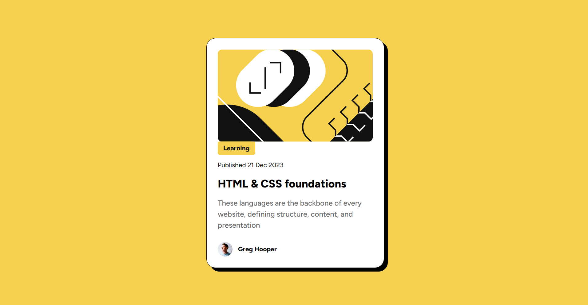
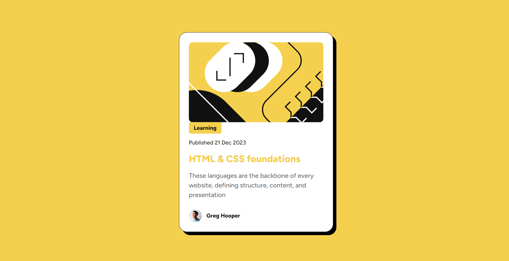

# Frontend Mentor - Blog preview card solution

This is a solution to the [Blog preview card challenge on Frontend Mentor](https://www.frontendmentor.io/challenges/blog-preview-card-ckPaj01IcS).

## Table of contents

- [Overview](#overview)
  - [The challenge](#the-challenge)
  - [Screenshot](#screenshot)
  - [Links](#links)
- [My process](#my-process)
  - [Built with](#built-with)
  - [What I learned](#what-i-learned)
  - [Continued development](#continued-development)
  - [Useful resources](#useful-resources)
- [Author](#author)

## Overview

A blog preview card resembling the one provided in the preview for the challenge from frontendmentor.io

### The challenge

Users should be able to:

- Transition smoothly between different screen layouts as specified

- See hover and focus states for all interactive elements on the page

### Screenshot





### Links

- Live Site URL: (https://your-live-site-url.com)

## My process

I focused on creating a semantic HTML for this challenge. I have added elements like section, article, figure, figcaption, etc. to make the markup more semantic. I styled the each section with appropriate paddings, margins, colors, font sizes, etc. I only moved on to the next section once I was happy with the current one. I also created custom properties for the styles that repeated.

### Built with

- Semantic HTML5 markup
- CSS custom properties
- Flexbox
- Mobile-first workflow

### What I learned

Semantic HTML

```html
<article class="card-text">
  <p class="category text-spacing">Learning</p>
  <p class="publish-date text-spacing">Published 21 Dec 2023</p>
  <h1 class="card-title text-spacing">HTML & CSS foundations</h1>
  <p class="card-description text-spacing">
    These languages are the backbone of every website, defining structure,
    content, and presentation
  </p>
</article>
```

CSS custom properties

```css
:root {
  --gray-500: hsl(0, 0%, 42%);
  --gray-950: hsl(0, 0%, 7%);
  --color-yellow: hsl(47, 88%, 63%);
}
```

### Continued development

The media queries could be extended to make the transition smoother. For example adding a better width for the card in between width sizes 400 and 480

### Useful resources

- [Semantic HTML](https://developer.mozilla.org/en-US/docs/Web/HTML/Element#text_content)
- [CSS Custom Properties](https://www.geeksforgeeks.org/what-are-css-custom-properties/)

## Author

- Frontend Mentor - [Veena-K-Venugopal](https://www.frontendmentor.io/profile/Veena-K-Venugopal)
